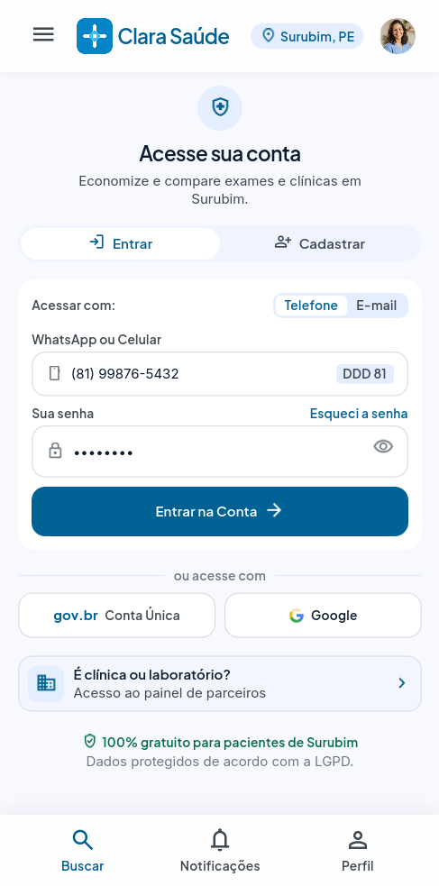
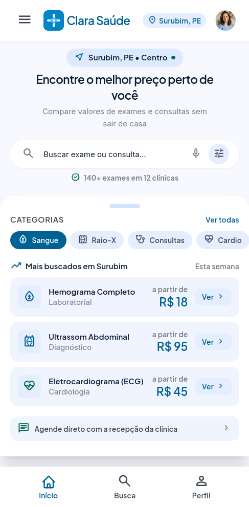
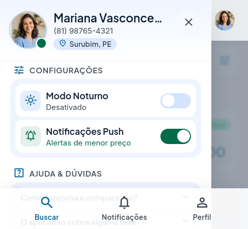
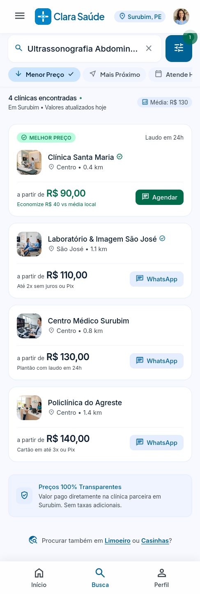
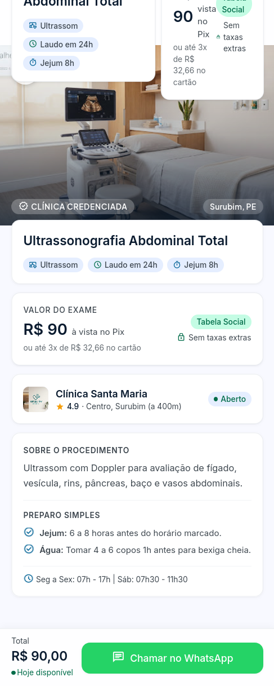
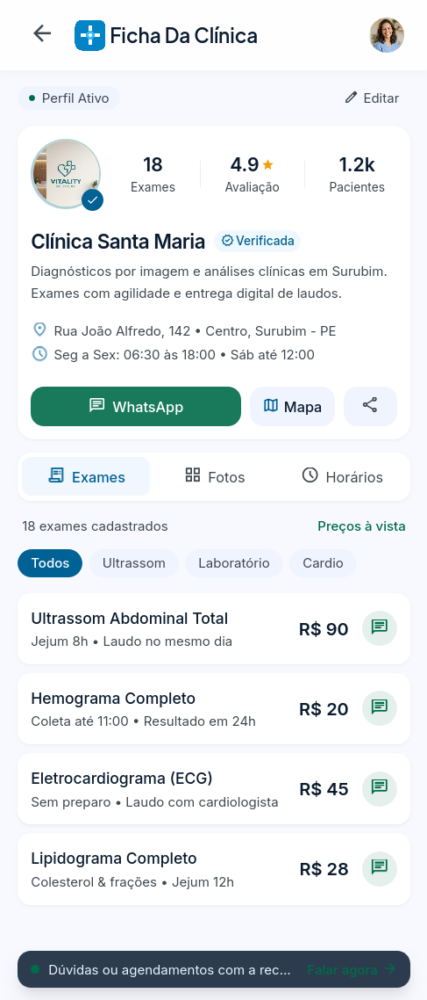
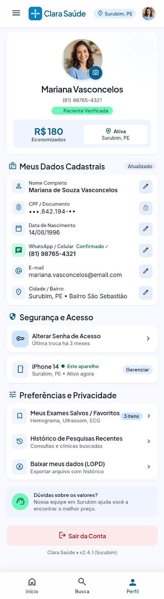

# Clinics Mobile

Aplicativo móvel para comparação de preços de exames médicos e consultas em clínicas e laboratórios de Surubim, Pernambuco, com agendamento direto pelo WhatsApp.

---

## Integrantes do Projeto

- Márcio Ferreira Lima
- Lucas Nascimento Barros

---

## Prototipação

O protótipo navegável de alta fidelidade das interfaces foi concebido no Google Stitch e serviu como base visual e de fluxo para a implementação no Flutter.

- Link do protótipo no Stitch: [Visualizar no Google Stitch](https://stitch.withgoogle.com/preview/7892859562446275708?node-id=7bfe8cef52094b30b5569ae58ea2e7c9)

---

## Galeria de Interfaces

Abaixo estão as interfaces construídas e funcionais da aplicação, seguindo a identidade visual estabelecida no protótipo.

| Login e Cadastro | Início e Busca Centralizada | Menu Lateral |
| :---: | :---: | :---: |
|  |  |  |

| Resultados e Comparação | Detalhes do Exame | Ficha da Clínica |
| :---: | :---: | :---: |
|  |  |  |

| Perfil do Usuário |
| :---: |
|  |

---

## Contexto do Projeto

O Clinics nasceu da necessidade de trazer mais transparência aos custos de saúde em Surubim. Muitas pessoas perdem tempo ligando ou se deslocando até diferentes clínicas para descobrir valores de exames laboratoriais e consultas particulares.

A plataforma centraliza essas informações em um ambiente simples e rápido. O paciente consulta o exame desejado, compara valores, entende o preparo necessário antes da coleta e entra em contato direto com a recepção da clínica via WhatsApp para agendar seu horário.

---

## Telas Implementadas

1. **Autenticação e Acesso**
   - Alternância entre as ações de entrar e criar conta.
   - Acesso por número de telefone ou e-mail.
   - Entrada integrada com conta Google.
   - Opção de entrada rápida como visitante para pesquisa imediata.

2. **Página Inicial e Busca**
   - Barra de pesquisa com suporte visual a comando por voz e filtros.
   - Categorias rápidas de exames: Sangue, Raio-X, Consultas, Cardio e Ultrassom.
   - Painel com os exames mais buscados da semana na região.
   - Barra de navegação inferior conectando o fluxo principal.

3. **Menu Lateral de Navegação**
   - Resumo do perfil do paciente logado.
   - Acesso direto para as seções do aplicativo e suporte.

4. **Resultados de Busca e Comparação**
   - Lista comparativa de clínicas que realizam o exame pesquisado.
   - Ordenação por menor preço ou melhor nota de avaliação.
   - Valores destacados com formas de pagamento e prazo de entrega do laudo.
   - Acesso imediato à conversa no WhatsApp de cada estabelecimento.

5. **Detalhes e Preparo do Exame**
   - Orientações de preparo, tempo de jejum e documentos solicitados.
   - Informações de endereço e horário da clínica selecionada.
   - Botão de contato no rodapé para início da conversa no WhatsApp com mensagem preenchida.

6. **Ficha Pública da Clínica**
   - Dados gerais da instituição, nota média e quantidade de exames oferecidos.
   - Navegação por abas com catálogo de exames, fotos dos consultórios e horários de funcionamento.
   - Botão para traçar rotas e contato no WhatsApp.

7. **Perfil do Usuário**
   - Informações cadastrais do paciente.
   - Preferências de notificações e encerramento seguro da sessão.

---

## Tecnologias e Padrões

- Flutter e Dart.
- Google Fonts com as famílias tipográficas Plus Jakarta Sans e Inter.
- GoRouter para o gerenciamento declarativo de rotas e parâmetros.
- Riverpod para suporte ao estado global da aplicação.
- URL Launcher para a integração direta com o aplicativo do WhatsApp.

---

## Como Executar o Projeto

1. Acesse o diretório do aplicativo:
```bash
cd clinics
```

2. Baixe as dependências do projeto:
```bash
flutter pub get
```

3. Execute a bateria de testes automatizados:
```bash
flutter test
```

4. Inicie o aplicativo em seu dispositivo ou emulador:
```bash
flutter run
```

---

## Estrutura de Pastas

```
clinics/
├── lib/
│   ├── core/
│   │   ├── router/
│   │   ├── theme/
│   │   └── utils/
│   ├── features/
│   │   ├── auth/
│   │   ├── search/
│   │   ├── exam/
│   │   ├── clinic/
│   │   └── profile/
│   └── main.dart
└── test/
    └── widget_test.dart
```
