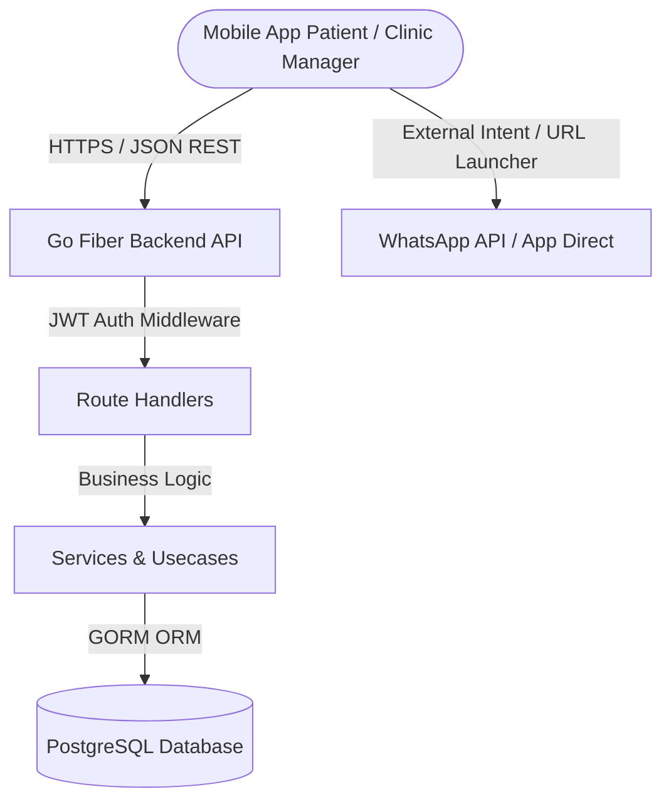
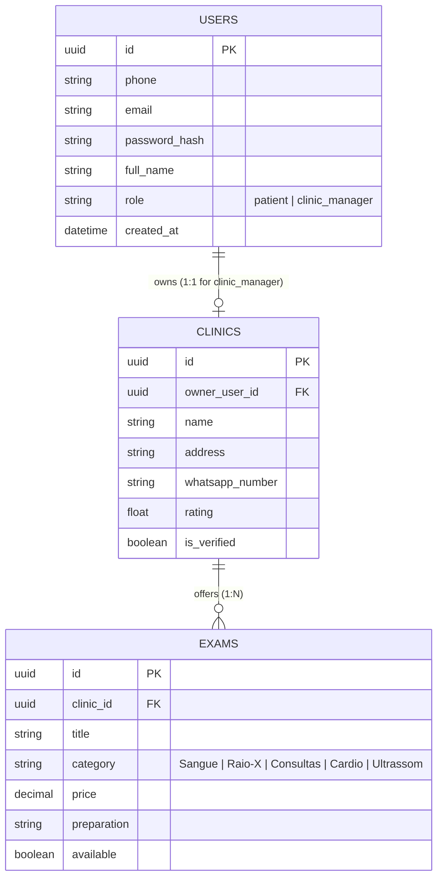

# 🏗️ System Architecture & Engineering Document (`ARCHITECTURE.md`)

**Application:** Clinics Mobile  
**Scope:** Mobile Client (Flutter) & Backend API (Golang)

---

## 1. High-Level System Architecture

The system follows a decoupled client-server architecture:



---

## 2. Frontend Architecture (Flutter Clean Architecture)

The Flutter project inside `clinics/` is organized into a **Feature-First + Clean Architecture** structure.

### 2.1. Layer Responsibilities

```
lib/features/<feature_name>/
├── data/
│   ├── datasources/        # Remote API calls (Dio/Http) and Local storage
│   ├── dtos/               # Data Transfer Objects (json_serializable)
│   └── repositories/       # Concrete implementation of domain interfaces
├── domain/
│   ├── entities/           # Pure Dart business objects
│   ├── repositories/       # Abstract repository interfaces
│   └── usecases/           # Specific business logic actions
└── presentation/
    ├── providers/          # Riverpod state providers (AsyncNotifier)
    ├── screens/            # Full page widgets (e.g., HomeScreen)
    └── widgets/            # Feature-specific sub-widgets
```

### 2.2. State Management with Riverpod

- Use `AsyncNotifierProvider` for remote API states (loading, data, error).
- Providers handle caching and invalidation cleanly.
- Immutable state objects using `freezed` or standard Dart `copyWith`.

---

## 3. Backend Architecture (Golang REST API)

The backend inside `backend/` follows idiomatic Go layering:

```
backend/
├── cmd/
│   └── server/
│       └── main.go         # Entrypoint & dependency injection setup
├── internal/
│   ├── api/
│   │   ├── handlers/       # HTTP requests parsing & response rendering
│   │   ├── middleware/     # Auth, IDOR check, CORS, recovery, logger
│   │   └── router.go       # Fiber route definitions
│   ├── core/
│   │   ├── domain/         # Core structs (User, Clinic, Exam)
│   │   ├── ports/          # Interfaces (Repositories, TokenService)
│   │   └── services/       # Core business logic implementations
│   └── infrastructure/
│       ├── database/       # PostgreSQL connection & GORM auto-migration
│       └── repository/     # GORM repository implementations
└── docker-compose.yml      # Local Postgres & Redis (optional)
```

---

## 4. Database ER Diagram & Relational Schema



---

## 5. Key Technical Flows

### 5.1. Authentication & Role-Based Navigation
1. User submits Phone & Password on `1._login_cadastro_onboarding`.
2. Backend validates credentials via BCrypt and returns JWT containing `user_id` and `role`.
3. Flutter App stores JWT securely via `flutter_secure_storage`.
4. `go_router` evaluates user role:
   - `role == "patient"` -> Navigates to `/home`.
   - `role == "clinic_manager"` -> Navigates to `/clinic/dashboard`.

### 5.2. WhatsApp Booking Redirection
1. Patient clicks "Agendar pelo WhatsApp" CTA on Exam Detail or Search Result Card.
2. App constructs URL: `https://wa.me/{clinic_whatsapp_number}?text={encoded_message}`.
   - Example message: *"Olá! Vi o exame {Exam.title} por R$ {Exam.price} no Clara Saúde e gostaria de agendar."*
3. `url_launcher` opens WhatsApp natively on iOS/Android.
